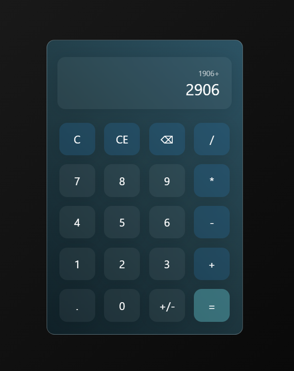

<br/>

<h1 align=center>Calculator made with React</h1>

<p align=center>
    <a href='https://gabrieldp23.github.io/React_Basic_Calculator/'>Click here to view live project</a><br><br/>
    
    &nbsp;
    
    &nbsp;
    
</p>    

<br/>

<div align=center>
It doesn't need a description, it's a calculator.

This project took less than a day to be completed.
</div>

<br/>

<div align=center>

</div>

<br/>
<br/>
<br/>

## 🖥 Running locally

```bash
# Clone
git clone https://github.com/gabrieldp23/React_Basic_Calculator.git

# Node modules
npm install

# Open project on localhost
npm start
```

